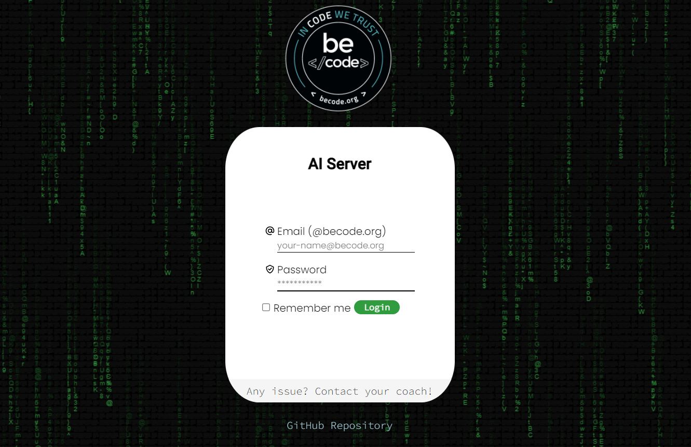

# AI Training tool

## Interface for BeCode Artificial intelligence class Machine learning tool

### The problem

At BeCode, the coaches were trying some options to allow the AI learners to use BeCode GPU machine.

One of those options was to provide a web User Interface to AI learners in order for them to launch AI model training in Docker container. For that, doker container manager is used. Unfortunately it doesn't support any kind of queue system and it does not enable CORS, which basicly means that we can't use their API and link it to a front-end.

To fix that, an AI coach made an API that manage queues and allow CORS , and this is the User Interface.

### Technologies used:

1. React
2. Styled Components
3. Cookies
4. Fetch
5. Animations

### The mission and requirements:

* Succesfully connect to the APIs with the correct information 
* Protected routes meaning no unauthorised access
* "remember me " allowing users to store their JWT in cookies
* Displaying success/ failure messages
* Dashboards letting users send their training to a queue using docker image slur 
* Showing the training status in the queue and past trainings and their status. 
* Visually appealing by making it resposive and adding animatons.

### Deployed on Heroku

[DogBook - Heroku](https://dog-book-dylan-boss.herokuapp.com/](https://ai-training-server.herokuapp.com/)

